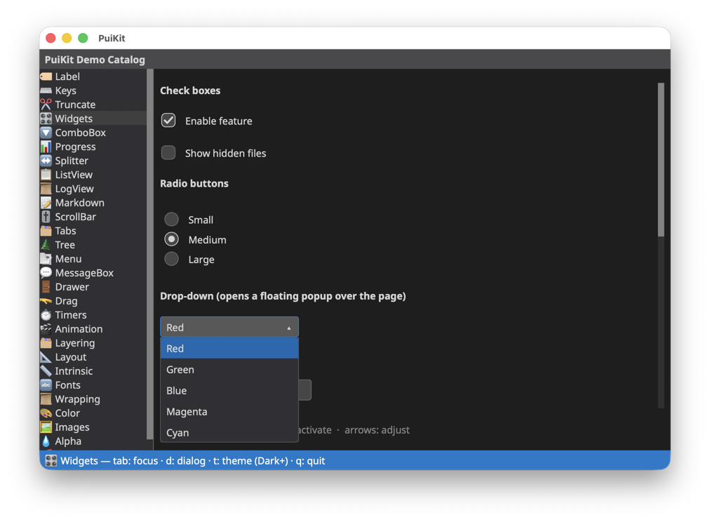
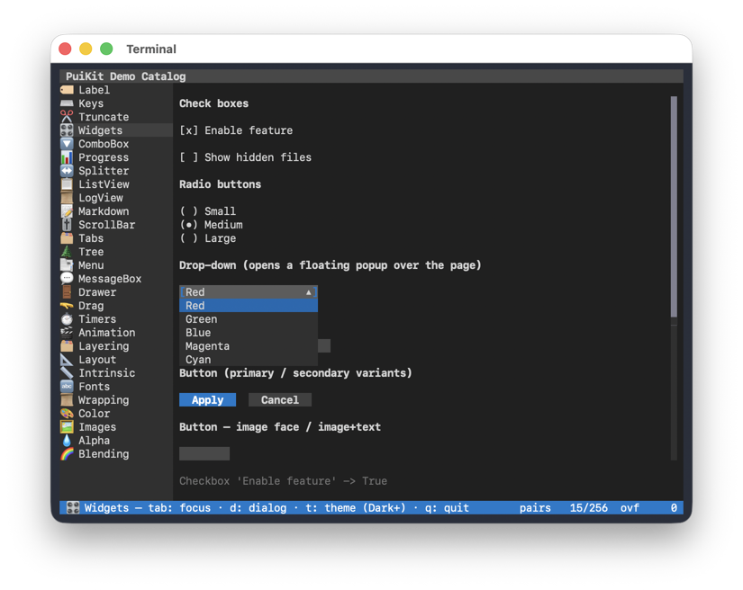
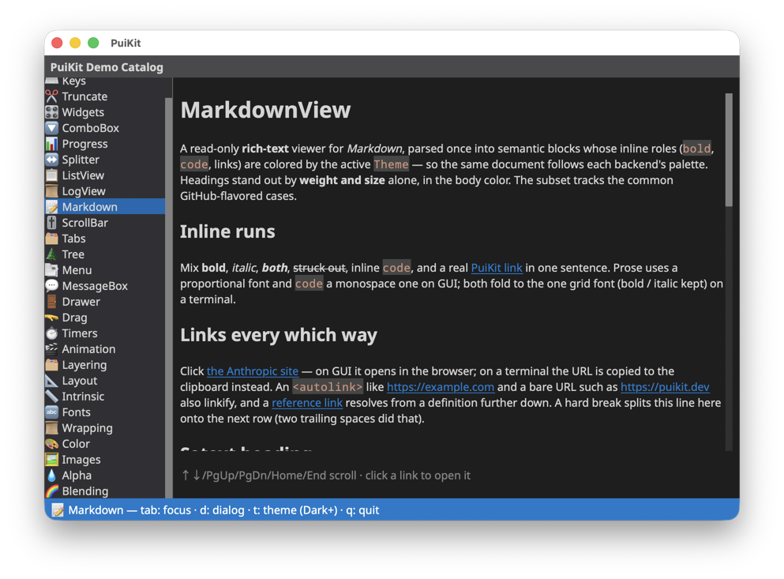
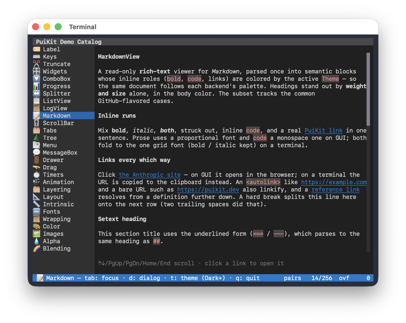
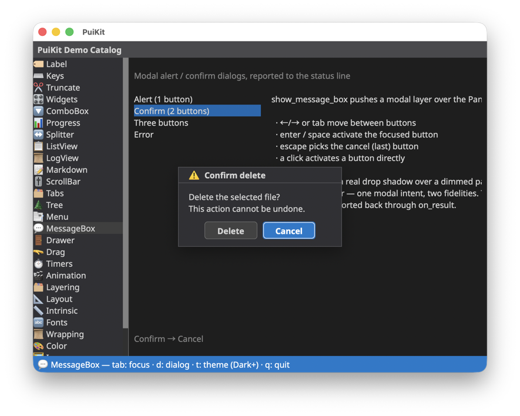
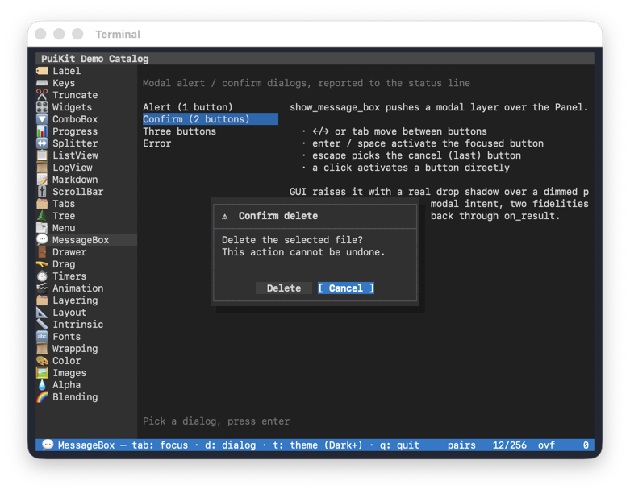

# PuiKit

PuiKit is a capability-based Python UI framework that supports both TUI
(terminal) and GUI (desktop, web) backends. Build apps and widgets once, run
them on multiple backends without splitting implementations.

- Apps and widgets specify **what to draw (intent)**
- **How to draw (implementation)** is decided by the backend
- Backends declare their capabilities; the Panel layer resolves fallbacks
- Widget code never branches on TUI/GUI

See the [documentation](https://github.com/crftwr/puikit/tree/main/docs) for
design notes and per-system guides (layout, rendering, color, animation, fonts,
widgets, and more).

## Screenshots

The bundled demo catalog, running unchanged on the macOS GUI backend and in a
terminal (curses backend).

| macOS GUI backend | Curses (terminal) backend |
| --- | --- |
|  |  |
|  |  |
|  |  |

## Apps built with PuiKit

- [**XeFM**](https://github.com/crftwr/xefm) — a dual-pane file manager that
  runs as a native desktop app on Windows and macOS, and in the terminal on all
  platforms, from a single codebase. PuiKit's first and most demanding user:
  archive / SFTP / S3 browsing, rich built-in viewers, and themes with GPU
  background shaders and CRT post effects.
- [**Keyhac 2**](https://github.com/crftwr/keyhac) — Python-scriptable keyboard
  customization for Windows and macOS, successor to Keyhac for Windows and
  Keyhac for macOS. Its UI is built on PuiKit.

Building something with PuiKit? Open an issue or PR to get it listed here.

## Status

Stable release (1.0). Implemented:

- Core framework: `Panel`, `Backend` interface, capability profiles, event model
- Layout system: `HSplit` / `VSplit` / `Item` with weights and `min_px` / `min`
  hints — snapped to whole base units on TUI, resolved at pixel granularity on GUI
- Animation: `panel.animate(widget, hints={"transition": "fade", "duration_ms": 200})`
  — transitions `fade` (opacity), `slide` (position), `scale` (visual zoom),
  `size` (layout reflow), and `highlight` (color) rendered on the macOS
  backend; immediate switch on TUI
- Widgets: `Label`, `ListView`, `ScrollBar`, `Container`
- Widget tree: containers nest widgets with hierarchical clipping; animations
  on a parent cascade to all descendants, while children stay individually
  animatable
- Backends:
  - `CursesBackend` — TUI, all platforms
  - `MacOSBackend` — macOS native GUI (PyObjC, installed automatically on macOS)
  - `WindowsBackend` — Windows native GUI (raw ctypes; Direct2D/DirectWrite)
  - `WebBackend` — runs in a web browser, launched with `webbrowser` over a
    local WebSocket (`--backend web`; see `docs/web_backend.md`)
  - `MemoryBackend` — headless, for tests
- Planned next: C++ CoreText render extension

## Quick start

```bash
pip install puikit
```

That's all you need — the base install ships a working TUI on every platform,
and a native window on macOS (PyObjC installs automatically; on Windows the
curses backport installs automatically). The minimal app below then runs as-is,
with no repository checkout required.

Want to see it move right away? The hello-world example is a single
self-contained file — download and run it without cloning the repo:

```bash
curl -O https://raw.githubusercontent.com/crftwr/puikit/main/examples/hello_world/main.py

python3 main.py                  # TUI — in a terminal, any platform
python3 main.py --backend gui    # native window — macOS
python3 main.py --backend web    # opens a browser tab — any platform
```

## Minimal app

```python
from puikit import EventType, Panel
from puikit.backends import create_backend
from puikit.widgets import Label

backend = create_backend("tui")
with backend:
    panel = Panel(backend)
    panel.add(Label("Hello, PuiKit!"), x=2, y=1, w=30, h=1)
    panel.render()

    def on_event(event):
        if event.type is EventType.KEY and event.key == "q":
            backend.quit()
            return
        panel.dispatch_event(event)
        panel.render()

    backend.run_event_loop(on_event)
```

Run it in a terminal for the TUI backend, or pass `--backend gui` (macOS) /
`--backend web` (any platform) if you wire up argument handling like the
bundled examples.

## Development (from source)

Clone the repository, then install editable with the dev extras:

```bash
python3.14 -m venv .venv
.venv/bin/pip install -e ".[dev]"

# Run the examples (in a terminal)
.venv/bin/python examples/hello_world/main.py
.venv/bin/python examples/demo_catalog/main.py

# On macOS, the same examples in a native window
.venv/bin/python examples/hello_world/main.py --backend gui
.venv/bin/python examples/demo_catalog/main.py --backend gui

# Or in a web browser (opens a tab; works on any platform)
.venv/bin/python examples/demo_catalog/main.py --backend web

# Run the tests
.venv/bin/python -m pytest
```

## Contact & Support

- **GitHub Issues**: [Report bugs or request features](https://github.com/crftwr/puikit/issues)
- **PyPI**: [pypi.org/project/puikit](https://pypi.org/project/puikit/) — released versions (`pip install puikit`)
- **Author's X (Twitter)**: [@crftwr](https://x.com/crftwr)

## License

See [LICENSE](https://github.com/crftwr/puikit/blob/main/LICENSE).
